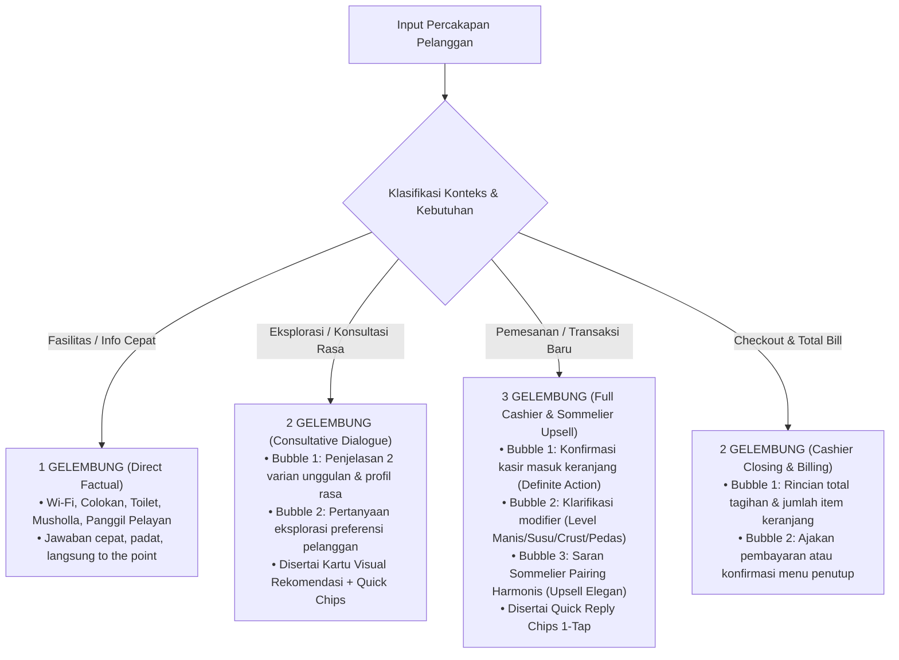

# PRD & Technical Specification: Situational Multi-Bubble AI Cashier & Sommelier Intelligence

## 1. Vision & Core Philosophy

AI pada AIODMA bukan sekadar bot perpesanan statis dengan jumlah gelembung kaku, melainkan **Master Cashier & Sommelier Virtual Cerdas** yang memiliki kesadaran situasi (*situational awareness*), keahlian komunikasi kasir nyata, teknik *upselling* harmonis, dan kecerdasan ritme dinamis (1, 2, atau 3 gelembung sesuai konteks percakapan).

---

## 2. Matriks Situasional Ritme Percakapan (1, 2, atau 3 Gelembung)

---

## 3. Skill & Kapabilitas Master Kasir & Sommelier AI

### 1. Kasir Presisi (*Order Management & Cart Awareness*)
- Membaca status keranjang meja secara *real-time*.
- Memahami jumlah kuantiti, item baru vs item tambahan, dan pembatalan item secara akurat.
- Memberikan rekapitulasi finansial yang jelas (Subtotal, Pajak PB1 10%, Total).

### 2. Konfirmasi & Modifikasi Menu (*Modifier Intelligence*)
- Mengetahui matriks kustomisasi resmi yang tersedia untuk setiap kategori menu:
  - **Kopi & Non-Kopi**: Level Gula (*Normal, Less Sugar 50%, No Sugar*), Suhu (*Es Normal, Less Ice, Panas*), Susu/Ekstra (*Ganti Oat Milk +6rb, Extra Shot +4rb, Boba +5rb*).
  - **Pizza**: Ukuran/Crust (*Reguler 6-Slice, Large 8-Slice +25rb, Stuffed Cheese +15rb*), Kepedasan (*Non-Spicy, Mild, Extra Spicy*), Ekstra (*Mozzarella +10rb, Pepperoni +12rb*).
  - **Makanan**: Karbo (*Nasi Putih, Nasi Butter +5rb, Fries +8rb*), Kepedasan (*Tidak Pedas, Mild, Pedas Gurih*), Ekstra (*Telur Mata Sapi +5rb, Ekstra Daging +12rb*).
  - **Pastry**: Penyajian (*Hangatkan / Warmed, Suhu Ruang*), Topping (*1 Scoop Vanilla Ice Cream +8rb*).

### 3. Sommelier Pairing & Upselling Harmonis (*Taste Harmony Engine*)
- Menawarkan kombinasi menu pendamping yang menggugah selera berdasarkan matriks harmoni rasa (*Sommelier Pairing Matrix*):
  - Kopi Manis/Aren $\rightarrow$ Pastry renyah (*Almond Pain au Chocolat*, *Croissant*).
  - Kopi Hitam/Americano $\rightarrow$ Cake lembut (*Basque Burnt Cheesecake*, *Tiramisu*).
  - Pizza Gurih $\rightarrow$ Minuman asam segar (*Sparkling Peach Tea*, *Wild Berry Lemonade*).
  - Makanan Berat/Curry $\rightarrow$ Minuman teh segar / *Matcha Latte* dingin.
  - Cemilan/Fries $\rightarrow$ *Craft Mocktail* / *Peach Tea*.

### 4. Zero-Hallucination Kitchen Grounding (*Live KDS Sync*)
- Menjawab status pesanan meja hanya berdasarkan data tiket dapur live di database (*preparing*, *ready*, *completed*) tanpa pernah mengarang nomor pesanan atau status palsu.

---

## 4. Spesifikasi Teknis Perubahan

### A. Backend (`server.js`)
- Memperbarui `systemInstruction` dengan **Situational Cadence Rules**: instruksi fleksibel bagi Gemini untuk menghasilkan 1, 2, atau 3 paragraf `\n\n` sesuai kompleksitas turn.
- Menghubungkan matriks sommelier pairing katalog secara utuh ke dalam konteks prompt.

### B. Client Engine (`js/app.js`)
- Fungsi `appendAiBubbles(bubblesArray)`: Mendukung rendering dinamis 1, 2, atau 3 gelembung percakapan dengan animasi mulus dan jeda mikro natural.
- Memperbarui seluruh cabang logika `handleOfflineSmartAI` agar memancarkan ritme 1, 2, atau 3 gelembung kontekstual.
