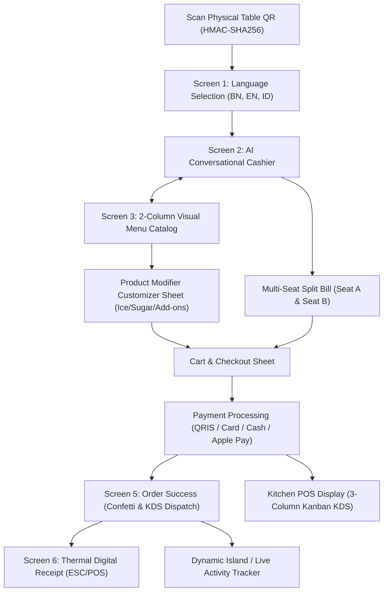

# AIODMA — Product Requirements Document (PRD) v2.0
### Conversational Ordering & Digital Menu Assistant (Enterprise & Native iOS Specification)

**Status:** Final Engineering Specification (v2.0)  
**Classification:** Internal & Confidential  
**Platform Target:** Modern Web App / PWA (Instant App Clip Experience) & Native iOS 17.0+ / iPadOS 17.0+ (SwiftUI, SwiftData, ActivityKit, CoreHaptics)  

---

## 1. Executive Summary & Core Value Proposition
AIODMA is an AI-powered conversational digital cashier and smart digital menu assistant designed to eliminate wait times, increase average order value (AOV) through intelligent non-intrusive upselling, and streamline restaurant operations.

Key Pillars:
1. **Instant Access (Zero-Install)**: Customers scan a table QR code or tap an NFC tag to immediately open a native-grade App Clip web interface without app installation.
2. **True Conversational AI Ordering**: Natural NLP ordering with real-time tool calling (`add_to_cart`, `remove_from_cart`, `transfer_cart_item`, `get_table_seats`).
3. **Cryptographic Anti-Bypass Security**: Table session bound via HMAC-SHA256 tokens; customers cannot hijack or redirect orders to other tables via chat prompt injections.
4. **Multi-Seat Split Bill (2–4 QR per Table)**: Independent carts and separate checkouts for companions at the same table (`bill_group_id`), with unified ticket generation for the kitchen.
5. **Interactive Item Customizer**: Real-time modifier sheets (Sugar, Ice, Extra Shot, Boba, Oat Milk) with instant price recalculation.
6. **Kitchen POS Display (KDS)**: 3-column live Kanban (*Received*, *Preparing*, *Ready*) with acoustic order chimes and thermal ESC/POS printing.
7. **Multi-Market Support**: Seamless locale switching between Indonesia (IDR / QRIS / GoPay / OVO) and Brunei Darussalam (BND / BIBD / Baiduri / Pocket).

---

## 2. Design System & Apple HIG Pro Standards
* **Color Tokens**:
  - `bg-system`: `#F4F5F8` (Light) / `#121316` (Dark)
  - `bg-card`: `#FFFFFF` / `#1C1D22`
  - `text-primary`: `#111111` / `#F9FAFB`
  - `accent-green`: `#10B981`, `accent-amber`: `#D97706`, `accent-caramel`: `#C27D38`
  - `badge-bestseller`: `#F8EFE3` (bg) / `#965B20` (text)
* **Shadow Elevation (Multi-Layer Ambient Depth)**:
  - Card: `0 2px 8px rgba(0,0,0,0.04), 0 1px 2px rgba(0,0,0,0.02)`
  - Hover/Active: `0 8px 24px rgba(0,0,0,0.06), 0 2px 6px rgba(0,0,0,0.03)`
  - Bottom Sheet: `0 -12px 40px rgba(0,0,0,0.12), 0 -2px 8px rgba(0,0,0,0.04)`
  - Floating Pill: `0 4px 14px rgba(0,0,0,0.14)`
* **Spring Curves**:
  - `cubic-bezier(0.34, 1.56, 0.64, 1)` (Apple Spring Bounce)
  - `cubic-bezier(0.16, 1, 0.3, 1)` (Smooth Fluid Ease)
* **Zero-Emoji Policy**: Strict adherence to vector SVG icons in production UI and AI messages.
* **Aspect Ratio**: 1:1 square ratio with `object-fit: cover` on all food and beverage photography.

---

## 3. End-to-End User Journeys

---

## 4. Multi-Device Viewport Scaling & Zero-Overlap Guarantee
- **iPhone SE / Small Phones (375px × 667px)**: Fluid typography (`clamp(22px, 5.5vw, 28px)`), compact margins, full touch target `44px × 44px`.
- **iPhone 15/16 Pro (393px × 852px)**: Native App Clip experience with full Dynamic Island tracker and sticky floating input.
- **iPhone 15/16 Pro Max (430px × 932px)**: Spacious 2-column grid, rich modifier sheet.
- **iPadOS KDS Mode (1024px+ Horizontal)**: 3-column Kanban board, live ticket countdown, and network printer test.
- **Desktop Web (100dvh Centered)**: Sleek 480px app column with floating admin controls in top right.

---

## 5. Security, Guardrails & Token Metering
1. **Table Anti-Bypass**: Injected text like *"antar ke meja 10"* is neutralized by server-side session token binding.
2. **Credit Wallet & Tiered Routing**:
   - Tier 0: Rule engine / Semantic cache (0 token cost).
   - Tier 1: Fast conversational router.
   - Tier 2: Frontier tool-calling agent.
   - Graceful fallback to Menu-Only mode if wallet reaches 0 credit.
3. **Emergency Support Console**: 60-minute break-glass token and instant Emergency AI Kill-Switch.
