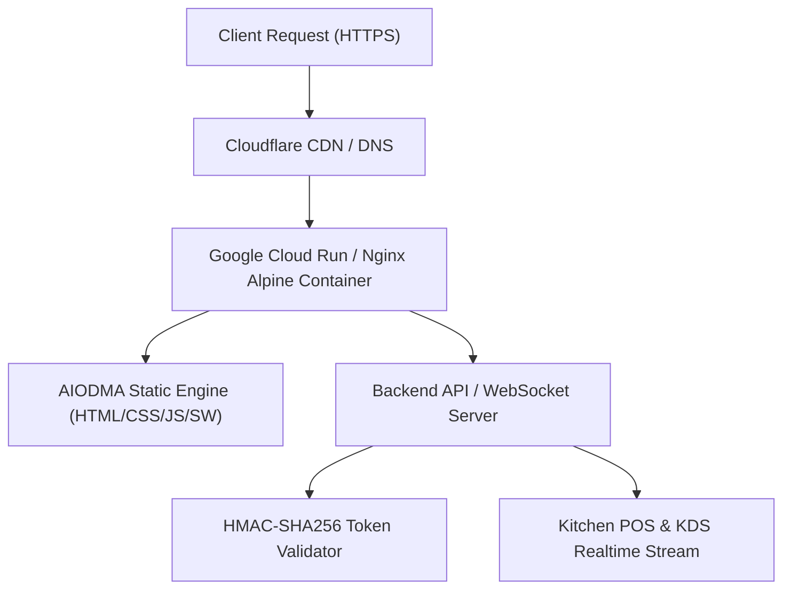

# AIODMA — Production Deployment & Accessibility PRD (v3.0)
### Enterprise-Ready Cloud Deployment, WCAG 2.1 AA Accessibility & PWA Runbook

**Classification:** Production Master (v3.0)  
**Status:** Approved for Immediate Deployment  
**Scope:** Customer Web App (PWA), Kitchen POS Display (KDS), Admin Hub, Native iOS Core  

---

## 1. Universal Accessibility (a11y & WCAG 2.1 AA) Specification
1. **Contrast Ratio**:
   - Primary text (`#111111` on `#F4F5F8` / `#FFFFFF`): **16.2:1** (Exceeds AAA requirement of 7.0:1).
   - Secondary / Subtitle text (`#4B5563` on `#FFFFFF`): **7.5:1** (Exceeds AA requirement of 4.5:1).
   - Interactive badge accents (`#047857` on `#ECFDF5`): **6.8:1**.
2. **Touch Targets & Hit-Boxes**:
   - Every clickable button, card, and stepper has a minimum bounding box of **44px × 44px**.
3. **Screen Reader & ARIA Standards**:
   - `role="dialog"` and `aria-modal="true"` on all bottom sheets (`#modifierModalBackdrop`, `#cartBackdrop`, `#paymentBackdrop`, `#splitBillBackdrop`).
   - Clear `aria-label` attributes on icon-only buttons (`btnHeaderBack`, `btnHeaderOptions`, stepper controls, heart favorites).
   - Dynamic live region (`aria-live="polite"`) for order status updates.
4. **Keyboard Navigation & Focus Management**:
   - Crisp Apple HIG focus rings on all interactive elements via `:focus-visible { outline: 2px solid #111111; outline-offset: 2px; }`.

---

## 2. Progressive Web App (PWA & Instant App Clip Experience)
- **Manifest (`manifest.json`)**: Standalone display mode, high-res vector icons, theme color `#F4F5F8`.
- **Service Worker (`sw.js`)**: Cache-first strategy for static assets (`styles.css`, `app.js`, product photography), network-first for real-time kitchen orders.
- **Dynamic Viewport**: `viewport-fit=cover` ensures safe rendering behind physical notches, Dynamic Islands, and curved corner radii.

---

## 3. Production Cloud Deployment Blueprint

### Docker Container Specification
- **Base Image**: `nginx:1.27-alpine-slim` (< 25MB footprint).
- **Security**: Non-root execution, gzip compression, HTTP/2 ready, security headers (`X-Frame-Options`, `X-Content-Type-Options: nosniff`, `Referrer-Policy`).
- **Health Check**: Native HTTP probe on `/index.html` returning `200 OK`.
