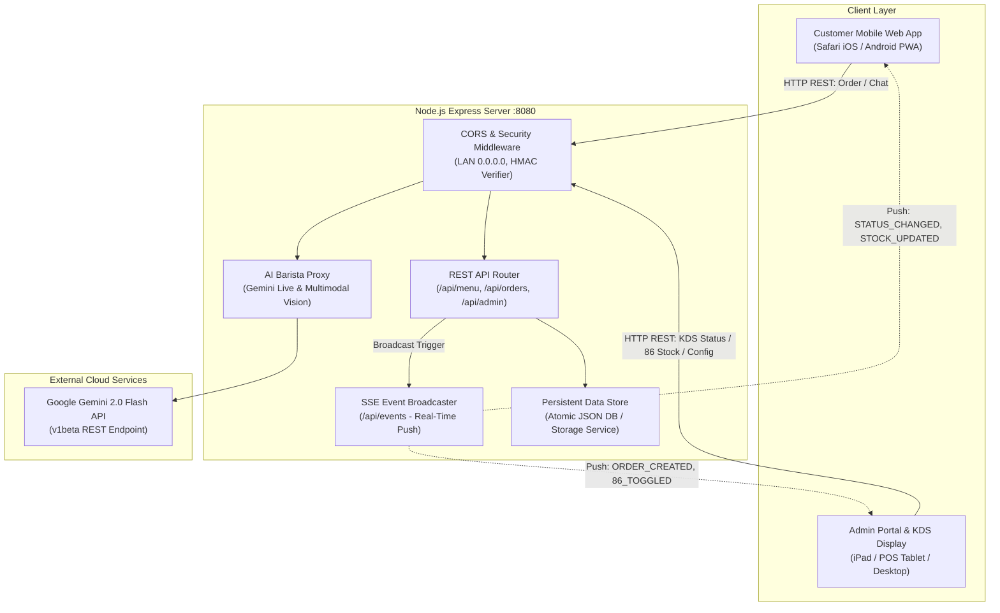

# AIODMA — PRD & Technical Architecture Spec v4.0
### Minimum Viable Operations (MVO) Production-Ready Architecture

---

## 1. Executive Summary & Objective

AIODMA (*AI Order Delivery & Management Assistant*) adalah platform pemesanan kafe nirsentuh berbasis AI dan PWA yang menghubungkan **Customer Mobile App** (iPhone / Android) dengan **Admin Operations & Kitchen Display System (KDS)** secara *real-time* lintas perangkat (*multi-device*).

Dokumen ini mendefinisikan arsitektur backend, skema data, REST API, protokol sinkronisasi *real-time* via Server-Sent Events (SSE), CORS, serta pengamanan HMAC dan AI Proxy agar aplikasi siap beroperasi di lingkungan kafe produksi (*Production-Ready MVO*).

---

## 2. Arsitektur Sistem & Topologi Multi-Device



---

## 3. Skema Data & Model Entitas (Database Schema)

### 3.1. `MenuItem` (Katalog Produk & Status Stok 86)
```typescript
interface MenuItem {
  id: string;             // e.g. "kopi_milk_aren", "pizza_pepperoni"
  name: string;           // Nama tampilan produk
  category: 'kopi' | 'non-kopi' | 'pizza' | 'makanan' | 'pastry' | 'cemilan';
  price: number;          // Harga satuan dalam Rupiah
  badge?: string;         // "Best Seller", "Barista Choice", "Popular", "New"
  available: boolean;     // Status ketersediaan (true = Tersedia, false = 86 / Habis)
  image: string;          // Path gambar lokal: assets/products/...
  desc: string;           // Deskripsi rasa & bahan
  modifiers?: {           // Opsi kustomisasi dinamis
    temperatures?: ('Dingin (Es)' | 'Hangat' | 'Panas')[];
    sugarLevels?: ('Normal' | 'Less Sugar' | 'No Sugar')[];
    crusts?: ('Classic Thin' | 'Cheesy Stuffed' | 'Sausage Crust')[];
    sizes?: ('Personal 4-Slice' | 'Regular 6-Slice' | 'Large 8-Slice')[];
    toppings?: { name: string; price: number }[];
  };
}
```

### 3.2. `Order` (Siklus Pesanan KDS & Kasir)
```typescript
interface OrderItem {
  itemId: string;
  name: string;
  price: number;
  qty: number;
  subtext?: string;       // Modifiers: "Es Normal, Less Sugar"
  image?: string;
}

type OrderStatus = 'PENDING_PAYMENT' | 'PAID_QUEUE' | 'PREPARING' | 'READY' | 'COMPLETED' | 'CANCELLED';

interface Order {
  id: string;             // e.g. "ORD_1787091234_ABC"
  orderNumber: string;    // e.g. "#1K04"
  table: string;          // e.g. "Meja 5"
  tableNum: number;       // 5
  tableToken?: string;    // HMAC token penanda validitas QR fisik meja
  items: OrderItem[];
  subtotal: number;
  tax: number;            // 10% PB1
  total: number;          // Subtotal + Tax
  paymentMethod: 'BIBD' | 'BAIDURI' | 'POCKET' | 'CASH';
  paymentStatus: 'PAID' | 'UNPAID';
  status: OrderStatus;
  idempotencyKey: string; // Mencegah pesanan ganda dari tap berulang
  notes?: string;
  createdAt: string;      // ISO 8601 Timestamp
  updatedAt: string;
}
```

### 3.3. `AIConfig` & `TokenUsage`
```typescript
interface AIConfig {
  apiKey: string;         // Google Gemini API Key (tersimpan di server)
  model: string;          // e.g. "gemini-2.0-flash"
  tone: 'warm' | 'fast' | 'formal';
  temperature: number;    // 0.0 - 1.0
  remainingCredits: number;
  totalInputTokens: number;
  totalOutputTokens: number;
}
```

---

## 4. Spesifikasi REST API & Server-Sent Events (SSE)

| Endpoint | Method | Fungsi | Keterangan |
|---|---|---|---|
| `/api/menu` | `GET` | Ambil katalog menu aktif beserta status ketersediaan (*available / 86*) | Client cache-friendly |
| `/api/orders` | `POST` | Buat pesanan baru dari HP pelanggan | Validasi idempotency, kurangi stok, push ke KDS via SSE |
| `/api/orders/:id` | `GET` | Ambil detail & status pesanan spesifik | Polling/fallback bila SSE terputus |
| `/api/orders/table/:tableNum` | `GET` | Ambil daftar pesanan aktif untuk nomor meja tertentu | |
| `/api/admin/orders` | `GET` | Ambil seluruh daftar tiket antrian KDS | Digunakan oleh Admin & Dapur |
| `/api/admin/orders/:id/status` | `PATCH` | Perbarui status pesanan (`PREPARING`, `READY`, `COMPLETED`, `CANCELLED`) | Memicu SSE ke HP pelanggan |
| `/api/admin/menu/:id/toggle-stock` | `PATCH` | Ubah status 86 (Habis / Tersedia) untuk menu tertentu | Memicu broadcast SSE instan ke semua HP |
| `/api/ai/chat` | `POST` | Proxy pemanggilan Gemini Live Barista dengan tool calling | Aman tanpa bocor API key ke browser |
| `/api/ai/vision` | `POST` | Proxy pemanggilan Gemini Vision untuk pertanyaan foto menu | Menerima base64 data & mengembalikan deteksi menu |
| `/api/admin/config` | `GET / POST`| Ambil / Simpan konfigurasi server AI & API Key | Tersinkronisasi ke seluruh sistem |
| `/api/admin/stats` | `GET` | Ambil agregat omzet hari ini, order aktif, dan token lift | Real-time analytics |
| `/api/events` | `GET (SSE)` | Stream event real-time lintas perangkat | Mengirim event `ORDER_CREATED`, `ORDER_STATUS_CHANGED`, `MENU_STOCK_CHANGED`, `CALL_WAITER` |

---

## 5. Protokol Real-Time Synchronization (SSE Event Stream)

Setiap klien (Customer App & Admin Portal) membuka koneksi SSE ke `/api/events`:

```typescript
// Event Types Broadcasted by Server:
type ServerEvent =
  | { type: 'ORDER_CREATED'; order: Order }
  | { type: 'ORDER_STATUS_CHANGED'; orderId: string; status: OrderStatus; tableNum: number }
  | { type: 'MENU_STOCK_CHANGED'; menuId: string; available: boolean }
  | { type: 'CALL_WAITER'; table: string; reason?: string }
  | { type: 'AI_CONFIG_UPDATED'; model: string; tone: string };
```

---

## 6. Pengamanan & Reliability (Production Hardening)

1. **CORS Configuration**: Mengizinkan akses dari seluruh IP LAN (`192.168.x.x`, `localhost`, `0.0.0.0`) dengan header `Access-Control-Allow-Origin: *`.
2. **Server-Side API Key Storage**: Kunci Gemini API tersimpan terpusat di server backend (`data/db.json` / environment), sehingga HP pelanggan yang baru terhubung ke Wi-Fi kafe tidak perlu memasukkan API key manual di HP mereka.
3. **Idempotency Key Cache**: Server menyimpan cache `idempotencyKey` selama 15 menit untuk memblokir duplikasi pesanan jika jaringan seluler/Wi-Fi pelanggan mengalami *re-transmit*.
4. **Resilient Local Fallback**: Jika server backend offline / mati, *frontend* secara otomatis mendeteksi kegagalan jaringan dan beralih ke *offline local mode* tanpa memunculkan layar putih/crash.
