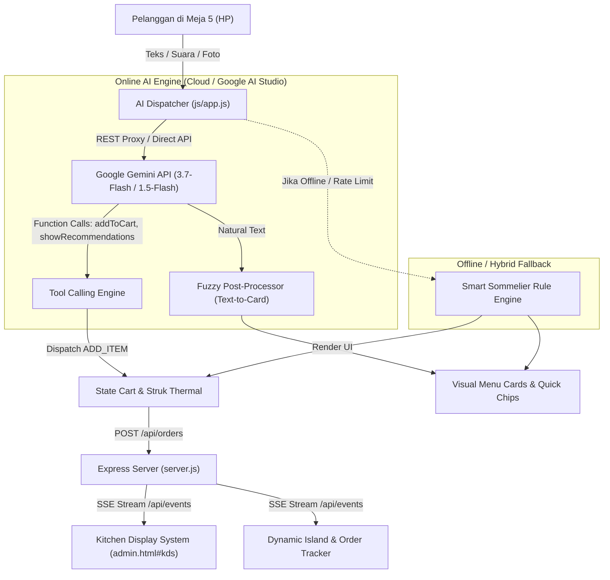

# 📖 AIODMA PRD v5.0: Production Online AI Agent & Autonomous Barista Architecture

---

## 1. Executive Summary & Vision

**AIODMA (Artificial Intelligence On-Demand Multi-Agent)** adalah sistem Point of Sale (POS), Kitchen Display System (KDS), dan **Autonomous AI Barista & Sommelier** berbasis web yang dirancang untuk mentransformasi pengalaman pemesanan makanan dan minuman di kafe modern.

Sistem ini beroperasi dengan prinsip:
1. **Zero-Friction Customer Journey**: Pelanggan memindai QR meja, berinteraksi secara natural (suara/teks/gambar), mendapatkan rekomendasi gastronomi berkelas (*soft-selling sommelier*), dan memesan langsung tanpa antre.
2. **Deterministic Cashier Precision**: Ekstraksi pesanan multi-item dan kustomisasi kompleks secara presisi ke dalam *Cart State* dan *KDS Dapur*.
3. **Multi-Model Interoperability & Resilient Fallback**: Bekerja mulus eksklusif dengan model Gemini generasi terbaru (`gemini-3.7-flash`, `gemini-3.5-flash-lite`, `gemini-3.1-pro-preview`, `gemini-2.5-pro`, `gemini-2.5-flash`) dengan *Smart Hybrid Rule Engine* offline cadangan.
4. **Hardware-Adaptive iOS Experience**: Integrasi eksklusif Apple Dynamic Island pada perangkat yang didukung (iPhone 14 Pro / 15 / 16 series) dan Universal Live Activity Banner pada seluruh perangkat lainnya.

---

## 2. Arsitektur Komponen & Alur Interaksi AI Online



---

## 3. Matriks Function Calling & Skema Tools AI

Online AI Agent dilengkapi dengan 6 Function Tools berstandar OpenAPI/JSON-Schema:

### 3.1. `addToCart` (Kasir Presisi Multi-Item)
- **Deskripsi**: Menambahkan 1 atau beberapa menu sekaligus ke keranjang Meja 5.
- **Parameter**:
  ```json
  {
    "items": [
      {
        "itemId": "kopi_milk_aren",
        "qty": 2,
        "modifiers": "1x Less Sugar, 1x Es Normal"
      },
      {
        "itemId": "pizza_truffle_mushroom",
        "qty": 1,
        "modifiers": "Extra Truffle Oil"
      }
    ]
  }
  ```
- **Fuzzy Resolver**: Secara otomatis mencocokkan input seperti `"kopi aren"`, `"pizza truffle"`, atau `"katsu"` ke ID katalog resmi 36 menu.

### 3.2. `showRecommendations` (Visual Sommelier Recommendation)
- **Deskripsi**: Menampilkan kartu visual produk lengkap dengan gambar HD, harga, dan tombol satu-sentuhan `+ Pesan`.
- **Parameter**:
  ```json
  {
    "itemIds": ["kopi_milk_aren", "almond_croissant"],
    "reason": "Perpaduan manis legit gula aren dan gurihnya kacang almond panggang."
  }
  ```

### 3.3. `openMenuCatalog` (Navigasi Katalog Visual)
- **Deskripsi**: Membuka katalog menu 36 item dengan filter kategori spesifik (`kopi`, `non-kopi`, `pizza`, `makanan`, `pastry`, `cemilan`).

### 3.4. `proceedToPayment` (Checkout Instan)
- **Deskripsi**: Membuka lembar pembayaran saat pelanggan mengonfirmasi pesanan sudah selesai.

### 3.5. `removeFromCart` (Modifikasi Keranjang)
- **Deskripsi**: Menghapus item tertentu berdasarkan nama/ID atau mengosongkan keranjang.

### 3.6. `callWaiter` (Panggilan Pelayan)
- **Deskripsi**: Menyiarkan notifikasi instan dan bunyi bel chime ke meja kasir admin.

---

## 4. Gastronomy Pairing Matrix & Soft-Selling Etiquette

Untuk menjaga kenyamanan pelanggan dan meningkatkan rata-rata nilai transaksi (*Average Order Value*), AI Agent menggunakan logika *Sommelier Soft-Selling*:

| Kategori Menu | Rekomendasi Pairing Ideal | Rasionalisasi Gastronomi |
|---|---|---|
| **Kopi / Espresso** | *Almond Croissant, Cinnamon Roll, Fudge Brownie* | Mentega Prancis dan kayu manis menyeimbangkan rasa pekat espresso. |
| **Makanan Gurih (Pizza / Pasta / Rice Bowl)** | *Sparkling Peach Tea, Wild Berry Lemonade, Cold Brew* | Asam segar buah asli menetralkan kekayaan saus keju dan daging. |
| **Dessert & Kue Manis** | *Iced Americano, Kyoto Matcha Latte* | Karakter bersih kopi hitam tanpa gula menonjolkan kelembutan rasa manis kue. |
| **Paket Budget (e.g. 50k)** | *Kopi Milk Aren (28k) + Butter Croissant (20k) = 48k* | Kombinasi kenyang & nikmat di bawah pagu budget pelanggan. |

---

## 5. Multi-Model Support & Failover Architecture

1. **Model Generasi Terbaru**:
   - `gemini-3.7-flash` (Flagship Cepat, Multimodal & Deep Thinking)
   - `gemini-3.5-flash-lite` (Ultra Ringan & Hemat)
   - `gemini-3.1-pro-preview` (Penalaran Sommelier Kompleks)
   - `gemini-2.5-pro` (Penalaran Kuliner & Gastronomi)
   - `gemini-2.5-flash` (Seimbang & Responsif)
2. **Failover Chain**:
   $$\text{Requested Model} \xrightarrow{404 / \text{Rate Limit}} \text{gemini-3.7-flash} \xrightarrow{} \text{gemini-3.5-flash-lite} \xrightarrow{} \text{gemini-3.1-pro-preview} \xrightarrow{} \text{gemini-2.5-pro} \xrightarrow{} \text{gemini-2.5-flash} \xrightarrow{} \text{Smart Rule Engine}$$
3. **Fuzzy Post-Processor**:
   - Jika model AI merespon dengan teks bebas tanpa memanggil function tool, sistem otomatis memindai teks, mencocokkan nama menu resmi, dan **tetap merender kartu visual menu interaktif** bagi pelanggan.

---

## 6. Kesiapan Produksi (*Production Checklist*)

- [x] **Zero-Emoji Policy**: Mematuhi standar tipografi bersih dan profesional.
- [x] **Table Anti-Bypass Guard**: Mengunci nomor meja sesuai sesi QR Meja 5.
- [x] **Idempotency Key Guard**: Menjamin tidak ada pesanan ganda (*double charge*).
- [x] **Real-Time KDS SSE Stream**: Sinkronisasi instan < 100ms antara dapur dan HP pelanggan.
- [x] **Thermal Receipt & Print**: Pencetakan struk kasir digital & fisik sesuai standar POS.
- [x] **100% Passing Automated Health Audit**: 10/10 modul lulus pengujian end-to-end.
