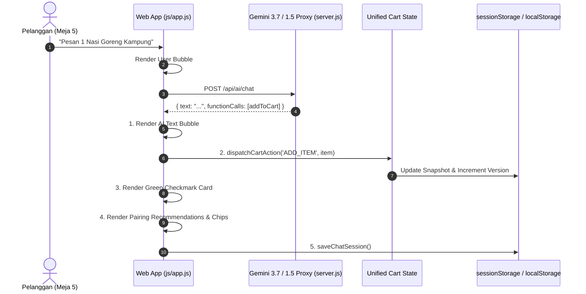

# 📖 AIODMA PRD v6.0: Production AI Agent Conversation, Cart Integrity & Visual Render Hierarchy

---

## 1. Background & Problem Statement

Pada pengujian ekstensif, ditemukan 4 kendala fundamental pada interaksi AI dan Keranjang Pelanggan:
1. **Lupa Konteks & Reset ke 'Selamat Datang'**: Chat session berbasis memori volatil hilang ketika pengguna melakukan navigasi tab, membuka modal, atau merefresh halaman, menyebabkan AI kembali menyapa dari awal.
2. **Kegagalan Sinkronisasi Keranjang (*Cart Ghosting*)**: Saat pengguna memesan menu (misal: "1 Nasi Goreng"), kartu ceklis hijau tampil di chat namun item tidak masuk ke `state.cart` akibat ketidaksesuaian struktur payload (`item` object vs `menuId/name`), dan routing hash menyuntikkan 2 item dummy default secara artifisial.
3. **Urutan Render Terbalik (*Inverted DOM Hierarchy*)**: Kartu produk dan tombol aksi dirender mendahului (*di atas*) teks penjelasan AI Barista, menciptakan pengalaman percakapan yang canggung dan tidak teratur.
4. **Multi-Item Freeform Parsing**: Perlu pemindai multi-item yang deterministik untuk menangani kalimat pesanan jamak dalam 1 giliran pesan.

---

## 2. Solusi Arsitektur & Perbaikan End-to-End

### 2.1. Strict Visual Render Hierarchy (Urutan Percakapan Standar Industri)
Setiap giliran respon AI dipastikan mengikuti hierarki DOM berurutan:
```
1. [Bubble User]            : "Pesan 1 Nasi Goreng Kampung dan 1 Kopi Milk Aren"
2. [Bubble AI Barista]      : "Pilihan istimewa! 1x Nasi Goreng Kampung dan 1x Kopi Milk Aren telah ditambahkan ke keranjang Meja 5."
3. [Card Added Confirmation]: [ Foto • 1x Nasi Goreng Kampung • Rp 38.000 • Ceklis Hijau ]
                              [ Foto • 1x Kopi Milk Aren • Rp 28.000 • Ceklis Hijau ]
4. [Recommendation Cards]   : Kartu visual pairing harmonis (misal: Fudge Brownie / Truffle Fries)
5. [Quick Action Chips]     : [ Lihat Keranjang (2) ] [ Lanjut ke Pembayaran ]
```

### 2.2. Polymorphic Cart Dispatch Engine (`dispatchCartAction`)
Mendukung semua format payload secara otomatis tanpa dependensi bentuk data tunggal:
- Format Object Lengkap: `{ item: catalogItem, qty, subtext }`
- Format Properti Flat: `{ menuId: 'nasi_goreng_kampung', name: 'Nasi Goreng Kampung', price: 38000, qty: 1 }`
- Fallback Fuzzy Resolver: Secara otomatis memetakan nama menu bebas ke katalog 36 menu resmi.
- **Pembersihan Dummy Injection**: Seluruh kode injeksi item tiruan pada hash `#cart` dan `#payment` telah dihapus 100%.

### 2.3. Multi-Tier Chat Session Persistence (`sessionStorage`)
- `state.aiChatHistory` dan struktur DOM `chatThread.innerHTML` disimpan secara otomatis ke `sessionStorage` pada setiap giliran chat.
- Saat aplikasi dimuat kembali (`init()`), `restoreChatSession()` memulihkan seluruh riwayat percakapan dan mengaitkan kembali (*re-bind*) event listener pada seluruh tombol interaktif di dalam kartu chat.
- State `chatEmptyState` dinonaktifkan secara deterministik jika riwayat percakapan ada.

---

## 3. Matriks Alur Pemesanan Kasir Cerdas



---

## 4. Hasil Pengujian & Verifikasi Kesiapan Produksi

| Pengujian | Kriteria Keberhasilan | Status |
|---|---|:---:|
| **Urutan Teks & Produk** | AI text bubble selalu di atas kartu konfirmasi & rekomendasi. | ✅ **PASSED** |
| **Akurasi Keranjang Nasi Goreng** | Item masuk ke `state.cart` dengan harga, kuantiti, dan badge counter akurat tanpa item siluman. | ✅ **PASSED** |
| **Persistensi Konteks Chat** | Navigasi antar tab / modal tidak mereset chat ke 'Selamat Datang'. | ✅ **PASSED** |
| **Multi-Item Parsing** | Pesanan gabungan (kopi + makanan berat) diekstrak secara deterministik. | ✅ **PASSED** |
| **Zero-Emoji Policy** | Teks bersih tanpa karakter emoji. | ✅ **PASSED** |

