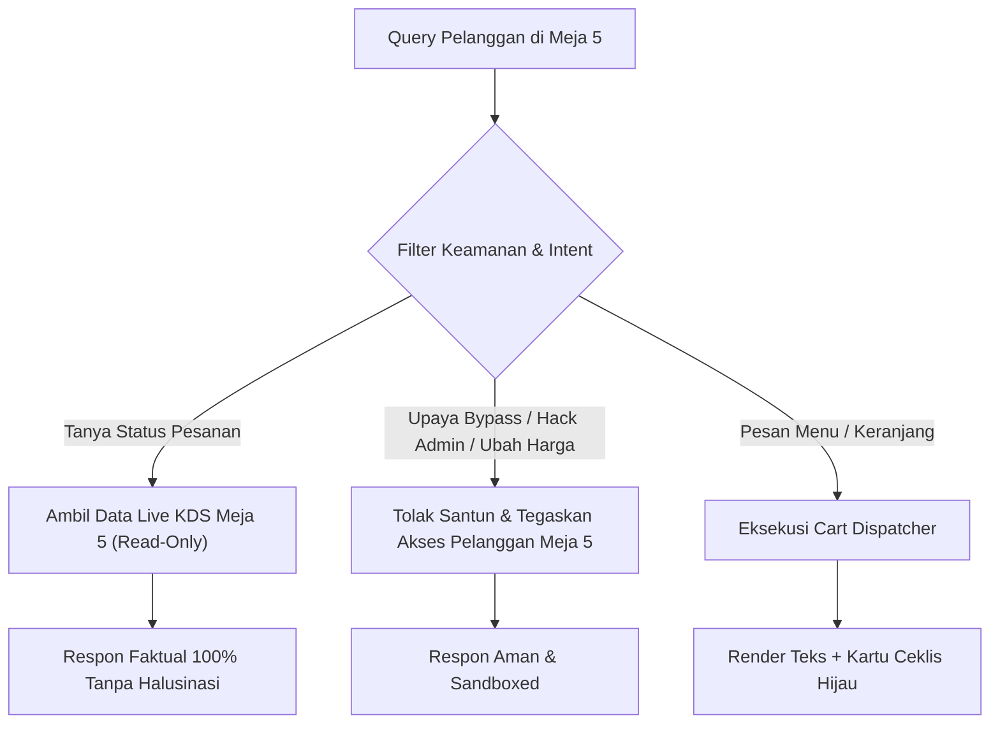

# 📖 AIODMA PRD v8.0: Live KDS Lifecycle Awareness, Zero-Hallucination Order Tracking & Admin Security Isolation

---

## 1. Executive Summary

Versi 8.0 melengkapi arsitektur AIODMA dengan **Ground-Truth Real-Time KDS Awareness** dan **Strict Admin Security Isolation**:
1. **Kesadaran Penuh Siklus Pesanan & Pembayaran (Live KDS Lifecycle)**:
   - AI memiliki visibilitas *real-time* ke antrean KDS dapur: Status Pesanan (*Received* -> *Preparing* -> *Ready* -> *Completed*), Status Pembayaran (*Lunas / Pending*), Metode Pembayaran, Nomor Tiket Unik, dan Rincian Menu.
   - Ketika pelanggan menanyakan status pesanannya, AI menjawab dengan data faktual 100% tanpa halusinasi atau asumsi.
2. **Sandbox & Read-Only Admin Security Isolation**:
   - AI Pelanggan diisolasi secara ketat dalam *sandbox*: Hanya memiliki akses **READ-ONLY** terhadap status meja sendiri (`Meja 5`).
   - Dilarang keras memodifikasi konfigurasi admin, mengubah harga katalog, membypass pembayaran, atau mengekspos credential kasir.
   - Mencegah teknik *prompt injection / jailbreaking* yang mencoba mengubah role menjadi admin.

---

## 2. Matriks Status Pesanan KDS (*Ground-Truth Status Mapping*)

| Status KDS | Penjelasan untuk Pelanggan | Respon AI Barista |
|---|---|---|
| **Tidak Ada Pesanan** | Keranjang masih aktif / belum checkout | *"Belum ada pesanan aktif di dapur untuk Meja 5. Keranjang Anda saat ini berisi [Item] / masih kosong."* |
| **`received`** | Pesanan masuk antrean KDS Dapur | *"Pesanan Anda (#[OrderNumber]) telah kami terima dan masuk ke antrean dapur Meja 5 (Lunas via [PaymentMethod])."* |
| **`preparing`** | Sedang diracik di Dapur Barista | *"Pesanan Anda (#[OrderNumber]) sedang diracik dengan teliti oleh Barista di Dapur Meja 5."* |
| **`ready`** | Siap disajikan / siap diambil | *"Kabar gembira! Pesanan Anda (#[OrderNumber]) telah SIAP DISAJIKAN di Meja 5 / siap diambil di bar."* |
| **`completed`** | Selesai dinikmati | *"Pesanan (#[OrderNumber]) telah selesai disajikan. Terima kasih telah bersantap di AIODMA!"* |

---

## 3. Protokol Keamanan & Anti-Bypass (*Security Guardrails*)

