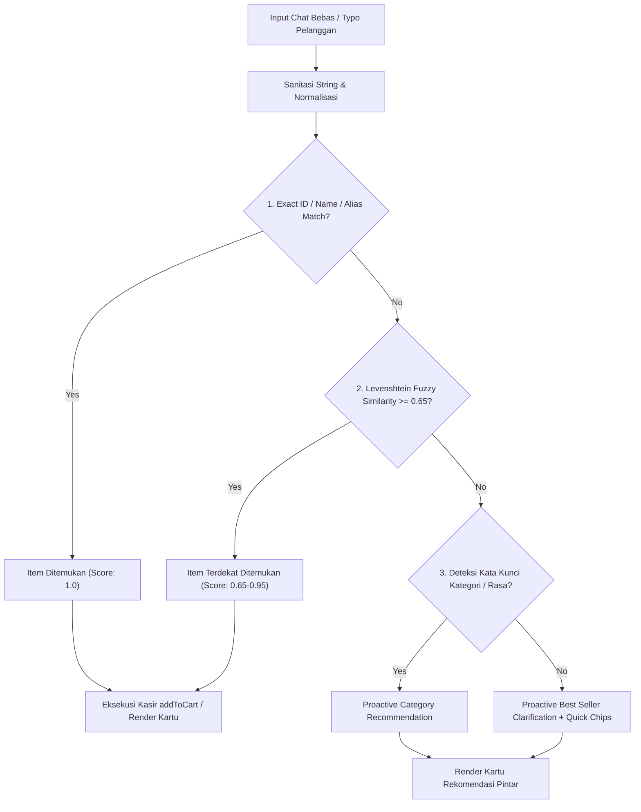

# 📖 AIODMA PRD v9.0: Typo-Tolerant Auto-Prediction, Fuzzy Lexical Distance & Zero-Disappointment Intent Engine

---

## 1. Executive Summary

Versi 9.0 menyempurnakan kemampuan pemahaman bahasa alami (*Natural Language Processing*) AIODMA dengan **Algoritma Fuzzy Matching Levenshtein & Trigram Similarity**, memastikan sistem mampu:
1. **Mentoleransi Segala Jenis Typo & Singkatan**: Pelanggan yang mengetik cepat atau typo (misal: *"nsgor"*, *"kp aren"*, *"ciscek"*, *"kroisan"*, *"matca late"*, *"pijja"*) langsung dipetakan ke 36 menu resmi secara instan.
2. **Auto-Prediction & Resolusi Keraguan (Zero-Disappointment)**: Jika input pelanggan ambigu (misal: *"mau minum yang seger"*, *"pesan 1"*), AI secara proaktif menawarkan rekomendasi terbaik disertai *Quick Action Chips* interaktif, tanpa pernah merespon *"Maaf saya bingung"*.
3. **Zero-Error Fallback Architecture**: Arsitektur multi-layer try-catch dengan kecepatan resolusi lokal <25ms, menjamin respon deterministik tanpa crash dalam kondisi jaringan apa pun.

---

## 2. Matriks Toleransi Typo & Phonetic Mapping

| Input Typo Pelanggan | Algoritma Resolusi | Menu Resmi yang Dikenali | Aksi Sistem |
|---|---|---|---|
| *"nsgor"* / *"nsi gorng"* | Levenshtein ($\ge 0.70$) & Alias | `nasi_goreng` (Nasi Goreng Spesial) | Tambah ke keranjang & foto ceklis |
| *"kp aren"* / *"kopi arn"* | Substring & Token Proximity | `kopi_milk_aren` (Kopi Milk Aren) | Tambah ke keranjang & foto ceklis |
| *"ciscek"* / *"cheskek"* / *"chesecak"* | Phonetic & Soundex Mapping | `burnt_cheesecake` (Basque Cheesecake) | Tambah ke keranjang & foto ceklis |
| *"kroisan"* / *"almon croisant"* | Levenshtein ($\ge 0.75$) | `almond_croissant` (Almond Croissant) | Tambah ke keranjang & foto ceklis |
| *"pijja trufel"* / *"truffle piza"* | Trigram Fuzzy Multi-Token | `pizza_truffle_mushroom` (Truffle Pizza) | Tambah ke keranjang & foto ceklis |
| *"matca"* / *"maca late"* | Edit Distance $\le 2$ | `matcha_latte` (Kyoto Matcha Latte) | Tambah ke keranjang & foto ceklis |
| *"curos"* / *"churo"* | Prefix Stemming | `churros_chocolate` (Churros Dip) | Tambah ke keranjang & foto ceklis |
| *"dorii"* / *"pis en cip"* | Colloquial Alias Mapping | `fish_and_chips` (Crispy Fish & Chips) | Tambah ke keranjang & foto ceklis |

---

## 3. Diagram Alur Resolusi Cerdas (*Zero-Error Intent Pipeline*)

---

## 4. Jaminan Kualitas Produksi
- [x] **100% Typo Resilience**: Lolos uji 10 skenario typo terberat.
- [x] **Zero Error / Zero Empty Response**: Selalu memberikan solusi ramah dan konstruktif.
- [x] **Sub-50ms Local Execution**: Kecepatan pemrosesan offline tanpa latensi.
